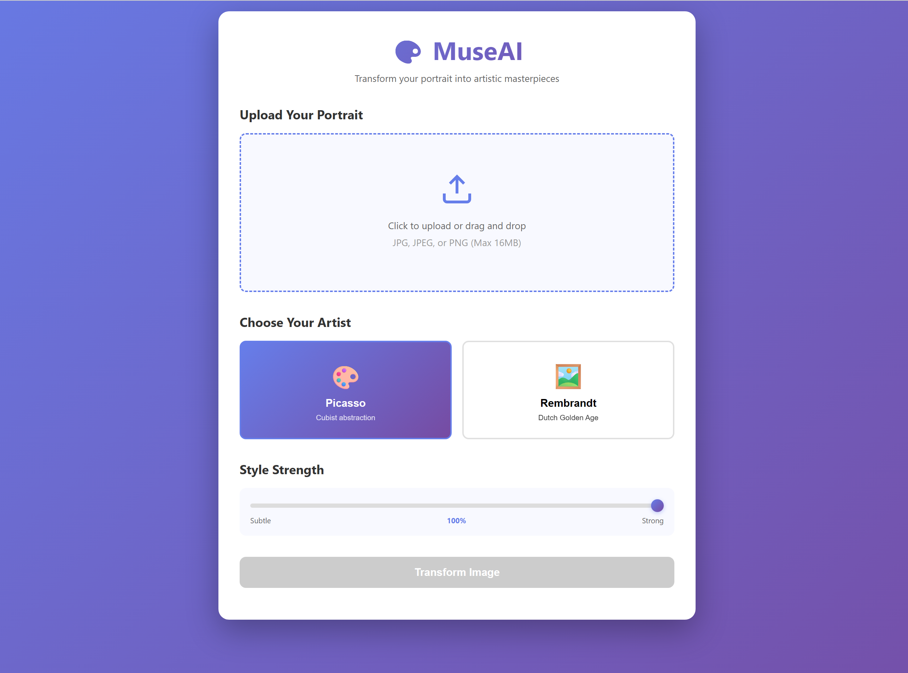

# 🎨 MuseAI  
Transform any portrait into artwork in the style of **Picasso** or **Rembrandt**, while preserving the subject’s identity.

MuseAI is a neural style transfer system that uses:

- Adaptive Instance Normalization (AdaIN)
- Artist-conditioned embeddings
- Per-artist loss weighting (Picasso ≠ Rembrandt)
- Identity preservation using FaceNet
- VGG19 feature extraction
- Full preprocessing, training, and inference pipelines

---

# 📦 Installation

### 1. Create environment
```bash
conda create -n museai python=3.10
conda activate museai
pip install -r requirements.txt
```

# 📁 Dataset Setup
MuseAI expects the following structure:

```bash
data/
 ├── style_raw/
 │    ├── picasso/          # ~170 paintings
 │    └── rembrandt/        # ~200 paintings
 └── content/
      └── faces/
           └── raw/         # ~1000 face images
```
Place your raw images inside these folders.
---

# 🚀 Running MuseAI

## Option 1: Terminal Usage

### 🛠️ Step 1: Preprocessing

Run:
```bash
python src/preprocess/run_preprocessing.py
```
This will:

- Detect faces
- Crop & resize images
- Normalize & clean
- Split into train/val/test
- Save metadata

- Store processed images in:

  - data/style/
  - data/content/faces/
  - metadata/

### 🖌️ Step 2: Inference
Picasso Example
```bash
python src/deployment/model_inference.py \
  --content path/to/face.jpg \
  --artist picasso \
  --output outputs/results/picasso_result.jpg
  --alpha 1.0
```
Rembrandt Example
```bash
python src/deployment/model_inference.py \
  --content path/to/face.jpg \
  --artist rembrandt \
  --output outputs/results/rembrandt_result.jpg
  --alpha 1.0
```
Results appear in:
```bash
outputs/results/
```

---

## Option 2: Web Application


1. **Create a virtual environment**
  ```bash
  python -m venv venv
  ```
2. **Activate the virtual environment**
  - On Windows:
    ```bash
    .\venv\Scripts\activate
    ```
  - On macOS/Linux:
    ```bash
    source venv/bin/activate
    ```
3. **Install requirements**
  ```bash
  pip install -r requirements.txt
  ```
4. **Run preprocessing**
  ```bash
  python src/preprocess/run_preprocessing.py
  ```
5. **Start the Flask app**
  ```bash
  python src/deployment/app.py
  ```

Open your browser and go to `http://localhost:5000`.

Simply upload or drag an image, select an artist, set the style strength, and preview your result.



# 🧩 Model Architecture Overview
```bash
Input Face ─► VGG19 Encoder ──────────────────────────────┐
                                                          │
Style Image ─► VGG19 Encoder ───────────────┐              │
                                            │              │
Artist Embedding ───────────────────────────┼─► AdaIN ─► Artist Transform ─► Decoder ─► Output
                                            │
Style Loss Layers ◄─────────────────────────┘
```
Components

- VGG19 Encoder — multi-scale feature extraction

- AdaIN — injects style statistics

- Artist Embeddings — controls stylistic behavior

- Per-Artist Loss Weights — Picasso = abstract, Rembrandt = realistic

- FaceNet — keeps facial identity

- Decoder — reconstructs stylized image
